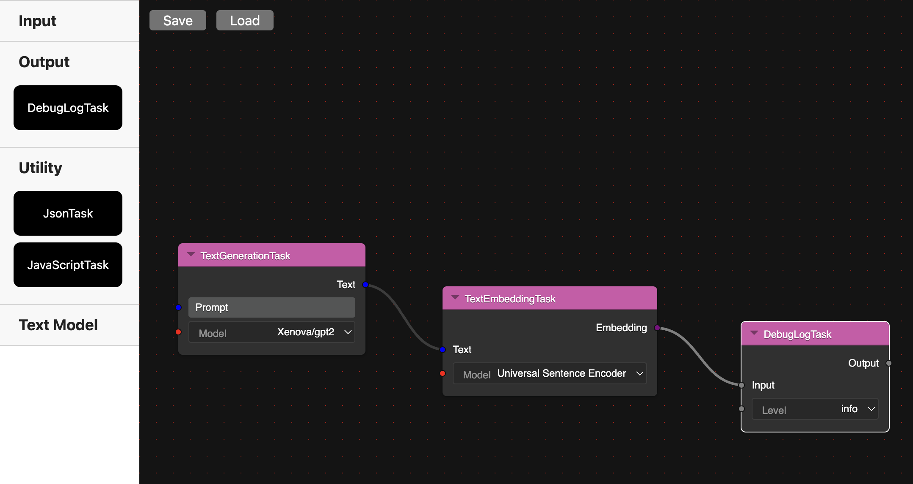

# ELLMERS

## Overview

The Embedding Large Language Model Experiential retrieval Service (ELLMERS) is a simple tool for testing LLM embedding strategies for document retreival. It is designed to be simple to use and easy to extend.

## Features

- Support for multiple LLM models
- Support for differnt instruction transformations
- Support for multiple dimensionalities for testing
- Support for different storage backends
- Support for different retreival strategies
- Support for different document formats

## Authors

- [Steven Roussey](https://stevenroussey.com)

## Docs

- **[Getting Started](docs/developers/01_getting_started.md)**
- **[Architecture](docs/developers/02_architecture.md)**
- **[Extending the System](docs/developers/03_extending.md)**

## Examples

### CLI

### Web

[Demo](https://loquacious-valkyrie-d5baf1.netlify.app/)

### Node Editor

