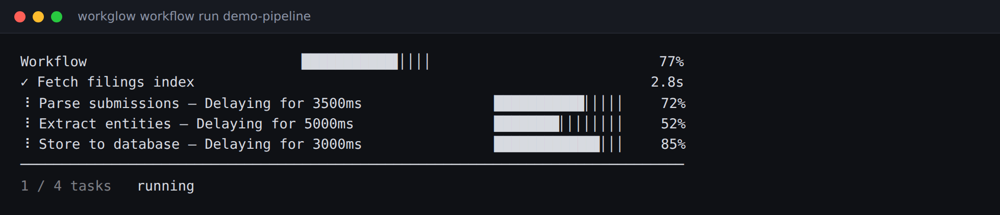
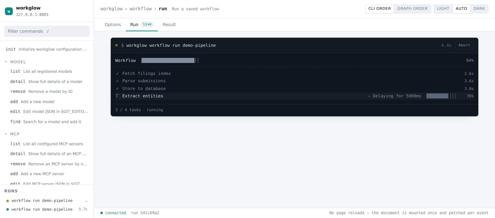
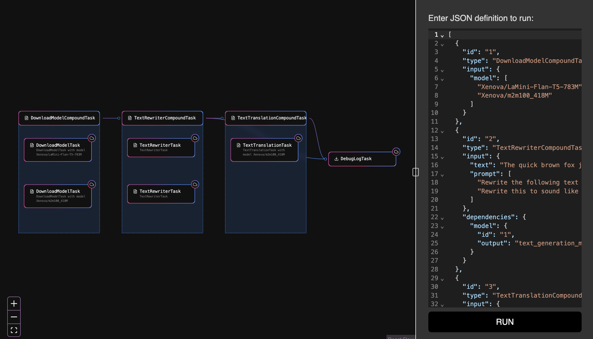

# WORKGLOW

## Overview

Simple library to build linear and graph based workflows. It is designed to be simple to use and easy to extend, yet powerful enough to handle task rate limits, retries, etc.

## Authors

- [Steven Roussey](https://stevenroussey.com)

## Roadmap

- [x] Release 0.1.0: Stable API for task(input,config) graph, storage, and job queue.\* _31 March 2026_
- [x] Release 0.2.0: Stable API for task(config), stable text generation; alpha: entitlements, browser control, toolcalling, and chat loops.\* _9 April 2026_
- [x] Release 0.3.0: Stable image generation, and job queue refactors. _20 May 2026_
- [ ] Release 0.x.0: Beta: chat loops, entitlments, user in the loop.
- [ ] Release 0.x.0: Stable toolcalling, chat loops, entitlments, user in the loop; beta: agent loops.
- [ ] Release 0.x.0: Stable agents.
- [ ] Release 0.x.0: Stable Browser control (direct and mcp).
- [ ] Release 0.x.0: Reworked output cache, checkpointing, and resumption.

_\*stable is a relative term, and will be updated at some point as we go before version 1.0.0._

## Docs

- **[Getting Started](docs/developers/01_getting_started.md)**
- **[Architecture](docs/developers/02_architecture.md)**
- **[Extending the System](docs/developers/03_extending.md)**

## Technical Deep Dives

- **[Task Graph DAG Engine](docs/technical/01-task-graph-dag-engine.md)**
- **[Dual Mode Execution](docs/technical/02-dual-mode-execution.md)**
- **[Control Flow Tasks](docs/technical/03-control-flow-tasks.md)**
- **[Dataflow and Streaming](docs/technical/04-dataflow-and-streaming.md)**
- **[Job Queue System](docs/technical/05-job-queue-system.md)**
- **[Composite Rate Limiting](docs/technical/06-composite-rate-limiting.md)**
- **[Storage Abstraction](docs/technical/07-storage-abstraction.md)**
- **[Knowledge Base and RAG](docs/technical/08-knowledge-base-and-rag.md)**
- **[Schema and Input Resolution](docs/technical/09-schema-and-input-resolution.md)**
- **[AI Task Framework](docs/technical/10-ai-task-framework.md)**
- **[AI Provider System](docs/technical/11-ai-provider-system.md)**
- **[Model Registry](docs/technical/12-model-registry.md)**
- **[Worker System](docs/technical/13-worker-system.md)**
- **[Entitlements System](docs/technical/14-entitlements-system.md)**
- **[Credential Management](docs/technical/15-credential-management.md)**
- **[Service Registry and DI](docs/technical/16-service-registry-di.md)**
- **[Event System](docs/technical/17-event-system.md)**
- **[Multi-Runtime Abstraction](docs/technical/18-multi-runtime-abstraction.md)**
- **[Build System](docs/technical/19-build-system.md)**
- **[Task Registry](docs/technical/20-task-registry.md)**
- **[Graph Data Structures](docs/technical/21-graph-data-structures.md)**
- **[MCP Integration](docs/technical/22-mcp-integration.md)**

## Packages

Packages:

- **[packages/storage](packages/storage/README.md)**
- **[packages/task-graph](packages/task-graph/README.md)**
- **[packages/job-queue](packages/job-queue/README.md)**
- **[packages/tasks](packages/tasks/README.md)**
- **[packages/ai](packages/ai/README.md)**
- **[providers/\*](providers/) — vendor provider packages (Anthropic, OpenAI, Gemini, Ollama, HuggingFace, llama.cpp, MediaPipe, Chrome AI, Cactus (needle-rs), Playwright, Electron, SQLite, Postgres, Supabase, bun-webview)**
- **[packages/util](packages/util/README.md)**
- **[packages/test](packages/test/README.md)**

- **[packages/workglow](packages/workglow/README.md)**

## Examples

### CLI

[examples/cli](examples/cli/README.md) is a full CLI built on the library. It runs any
saved workflow, agent, or single task as a task graph, and renders that graph live —
a row per task with its status, detail, progress and duration, over a bar for the run
as a whole.

The same commands are also available in a local web console, served by the CLI itself
with `workglow web`. It reads the command tree off the live program, so every command
— including those a downstream CLI adds — gets a form built from the same schemas the
terminal prompts from, and the run it starts streams into the same graph view.

### Web

[Demo](https://workglow-web.netlify.app/)

### Node Editor

[Local Drag and Drop Editor](https://workglow.dev)

