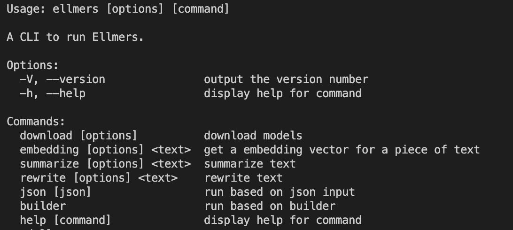

- [Developer Getting Started](#developer-getting-started)
- [Get Shit Done](#get-shit-done)
  - [Preset Configs](#preset-configs)
  - [TaskGraphBuilder](#taskgraphbuilder)
  - [JSON Configuration](#json-configuration)
- [Going Deeper](#going-deeper)
  - [Tasks](#tasks)
  - [DataFlows](#dataflows)
- [Configuration Options](#configuration-options)
  - [Queues](#queues)
  - [LLM Providers](#llm-providers)
  - [Storage](#storage)
    - [Caching](#caching)
- [Appendix](#appendix)
  - [Source](#source)
    - [`docs/`](#docs)
    - [`packages/core`](#packagescore)
    - [`packages/cli`](#packagescli)
    - [`packages/web`](#packagesweb)

# Developer Getting Started

This project is not yet ready to be published on npm. So for now, use the source Luke.

git clone https://github.com/sroussey/ellmers.git
cd ellmers
bun install
bun run build
cd packages/web
bun run dev

This will bring up a web page where you can edit some json to change the graph. And there is a RUN button.

Also, you can open the panel (follow the instructions for enabling Console Formatters for best experience). A simple task graph builder is available there. Just type `builder` in the console and you can start building a graph. With the custom formatters, you can see the graph as you build it, as well as documentation. Everything self documents.

# Get Shit Done

```ts
import { TaskGraphBuilder, registerHuggingfaceLocalTasksInMemory } from "ellmers-core/server";
// config and start up
registerHuggingfaceLocalTasksInMemory();

const builder = new TaskGraphBuilder();
builder
  .DownloadModel({ model: "Xenova/LaMini-Flan-T5-783M" })
  .TextRewriter({
    text: "The quick brown fox jumps over the lazy dog.",
    prompt: ["Rewrite the following text in reverse:", "Rewrite this to sound like a pirate:"],
  })
  .rename("text", "message")
  .DebugLog();
builder.run();
```

This is equivalent to:

```ts
import {
  DownloadModelTask,
  TextRewriterCompoundTask,
  DebugLog,
  DataFlow,
  TaskGraph,
  TaskGraphRunner,
  getProviderRegistry,
  HuggingFaceLocal_DownloadRun,
  HuggingFaceLocal_TextRewriterRun,
  InMemoryJobQueue,
  ModelProcessorEnum,
  ConcurrencyLimiter,
  TaskInput,
  TaskOutput,
} from "ellmers-core/server";

// config and start up
const ProviderRegistry = getProviderRegistry();
export const flanT5p786m = new ONNXTransformerJsModel( // auto registers on creation
  "Xenova/LaMini-Flan-T5-783M",
  [ModelUseCaseEnum.TEXT_GENERATION, ModelUseCaseEnum.TEXT_REWRITING],
  "text2text-generation"
);
ProviderRegistry.registerRunFn(
  DownloadModelTask.type,
  ModelProcessorEnum.LOCAL_ONNX_TRANSFORMERJS,
  HuggingFaceLocal_DownloadRun
);
ProviderRegistry.registerRunFn(
  TextRewriterTask.type,
  ModelProcessorEnum.LOCAL_ONNX_TRANSFORMERJS,
  HuggingFaceLocal_TextRewriterRun
);
const jobQueue = new InMemoryJobQueue<TaskInput, TaskOutput>(
  "local_hf",
  new ConcurrencyLimiter(1, 10),
  10
);
ProviderRegistry.registerQueue(ModelProcessorEnum.LOCAL_ONNX_TRANSFORMERJS, jobQueue);
jobQueue.start();

// build and run graph
const graph = new TaskGraph();
graph.addTask(new DownloadModel({ id: "1", input: { model: "Xenova/LaMini-Flan-T5-783M" } }));
graph.addTask(
  new TextRewriterCompoundTask({
    id: "2",
    input: {
      text: "The quick brown fox jumps over the lazy dog.",
      prompt: ["Rewrite the following text in reverse:", "Rewrite this to sound like a pirate:"],
    },
  })
);
graph.addTask(new DebugLog({ id: "3" }));
graph.addDataFlow(
  new DataFlow({
    sourceTaskId: "1",
    sourceTaskOutputId: "model",
    targetTaskId: "2",
    targetTaskInputId: "model",
  })
);
graph.addDataFlow(
  new DataFlow({
    sourceTaskId: "2",
    sourceTaskOutputId: "text",
    targetTaskId: "3",
    targetTaskInputId: "message",
  })
);
```

## Preset Configs

## TaskGraphBuilder

## JSON Configuration

# Going Deeper

## Tasks

## DataFlows

# Configuration Options

## Queues

## LLM Providers

## Storage

### Caching

# Appendix

## Source

### `docs/`

You are here.

### `packages/core`

This is the main library code.

### `packages/cli`

An example project that uses the library in a CLI settings using listr2 (`cat example.json | ellmers json`, for example)



### `packages/web`

An example project that uses the library in a web setting, running locally in browser.


Don't forget to open the console for some goodies.
